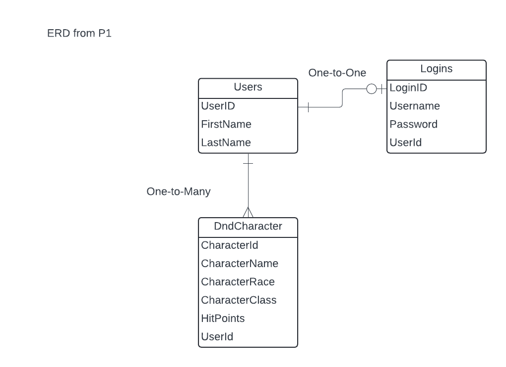

# Magic-Melee

# Project Overview

Character Sheet Creator that allows users to save their characters.

# MVP Features

- User can log in and out
- User can create view, update, and delete multiple characters of their own

# Entity Relationship Diagram

- https://lucid.app/lucidchart/b2425a08-ef07-469b-a112-ff94317856d7/edit?invitationId=inv_d6d9c7e3-76bd-4e57-bcf3-68323d4a107f

# External API Used

- DnD 5E API - http://www.dnd5eapi.co/

# Stretch Goals

- React Frontend

# Git Practice/ Process

- Git: Feature branches,
- pull request to dev requires 2 approvals,
- final commit to main requires whole team approval

# Coding Convention/Practice

- semantic variable names
- standard ASP.net

# Communication Standard

## Medium

- Discord

## Frequency

- daily 10min standup

## Project Board management

- Trello
